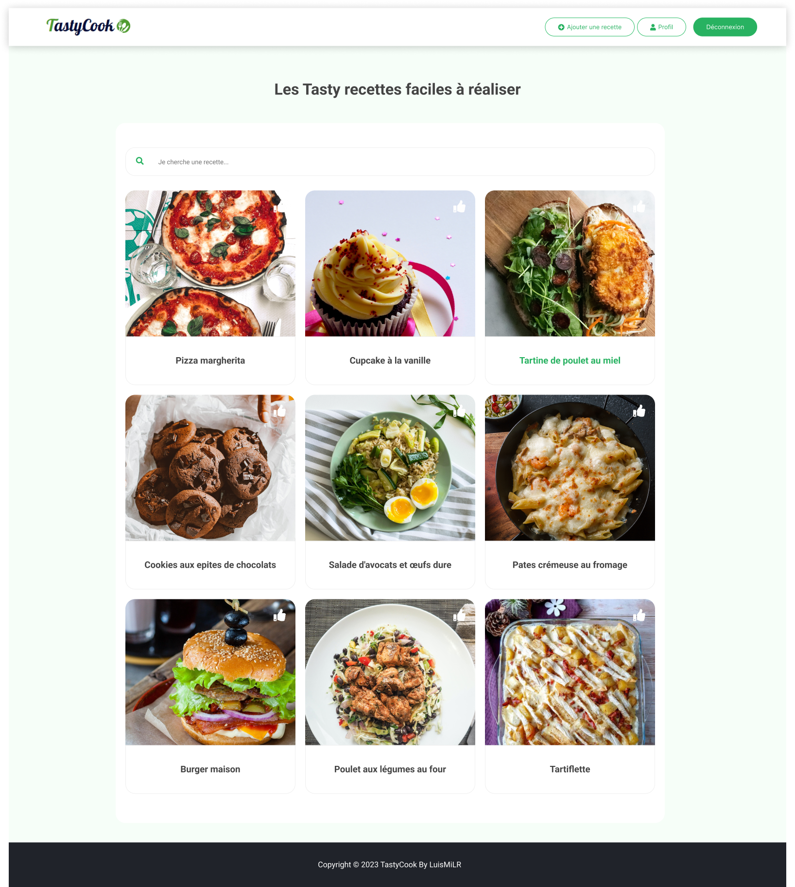

## **TastyCook Recipe FullStack Project React.js, Sass, Node.js, MySql, Sequelize** 
#### **by LuisMiLR** 

### **Installation de l’application :** 
(Bash)
- npm install 
- npm start

## 1. PRÉSENTATION

Site communautaire de recettes, ou les recettes presentent sont celle des utilisateurs, leurs permettants de rechercher, créer, modifier et supprimer des recettes.

Le Frontend est créé la bibliothèque React.js et le préprocesseur Sass pour la mise en forme.   Le Backend est réalisé avec Node.js, le framework Express.js, MySql, et l'ORM Sequelize.

La barre de recherche détecte les premières lettres saisies pour ensuite affiner la recherche et les recettes affichées. Il s'agit de la première version 1.1 du projet. D'autres améliorations sont prévues dans le futur. il s'agit de la version 1.1 

## Détails Techniques

### 2. AUTHENTIFICATION

L'authentification des utilisateurs est gérée à l'aide de plusieurs technologies sécurisées :

- **Création d'un accès :** Lorsqu'un utilisateur crée un compte, les informations sont stockées de manière sécurisée dans la base de données MySql à l'aide de Sequelize. Le mot de passe est haché à l'aide de Bcrypt pour garantir la confidentialité des informations.

- **Connexion :** Les utilisateurs se connectent en utilisant des mécanismes sécurisés tels que JWT (JSON Web Token) pour gérer les sessions et assurer la confidentialité des données.

- **Protection des opérations :** Avant de permettre la modification ou la suppression d'une recette, des vérifications de sécurité sont effectuées pour s'assurer que l'utilisateur a les autorisations nécessaires. Des mécanismes tels que les tokens JWT et les contrôles côté serveur sont utilisés pour garantir l'intégrité des données.

- **Hachage du mot de passe :** Le mot de passe des utilisateurs est haché à l'aide de l'algorithme Bcrypt, renforçant ainsi la sécurité en cas d'éventuelle compromission des données.

- **Validation du mot de passe :** Lors de la création du mot de passe, des expressions régulières (regex) sont utilisées pour s'assurer que le mot de passe répond à des critères de complexité, garantissant ainsi des niveaux de sécurité appropriés.

Ces mesures de sécurité garantissent que seuls les utilisateurs autorisés peuvent accéder et modifier les données du site.

